<div align="center">



# 🛡️ Calvary Porn Blocker

[](#)
[](./docs/PRIVACY_POLICY.md)
[](#)
[](#)

<br/>

> **A free, open-source content filter built for individuals, families, ministries, and schools — designed to help people break free from pornography addiction and protect those they love.**

<br/>

[**⬇️ Download for Windows**](#-download--installation) &nbsp; | &nbsp; [**📖 Read Documentation**](#-getting-started) &nbsp; | &nbsp; [**💬 Join Community**](#-community--support)

</div>

<br/>

## 📖 The Vision

In a world where platforms use dark-pattern design to keep users engaged and addicted, **Calvary Porn Blocker** stands as a tool for freedom. We believe that technology should serve people, not enslave them. 

Pornography addiction is a widespread crisis that damages relationships, exploits the vulnerable, and corrupts the mind. This project exists to provide a ministry-grade, ISO-aligned safety net that enforces purity and accountability through uncompromised engineering.

<details>
<summary><kbd>✨ Click to read more about our core mission</kbd></summary>
<br>

From a Christian perspective, pornography is spiritually destructive. It corrupts the mind, damages families, and pulls people away from purity, truth, and faithfulness. People need both practical tools and spiritual support: accountability, honest community, content blockers, mentorship, counseling, and the Gospel. Recovery requires both truth and action.

> *"Flee from sexual immorality."* — 1 Corinthians 6:18

</details>

---

## ⚡ Download & Installation

Calvary Porn Blocker is designed to run everywhere you need protection. 

<div align="center">

| Platform | Status | Download Link | Instructions |
| :---: | :---: | :--- | :--- |
| **Windows** | 🟢 Active | [**Download .exe (v1.0.0)**](#) | Run installer & deploy via PowerShell |
| **macOS** | 🟡 Beta | [**Download .dmg (v1.0.0-beta)**](#) | Mount image & install to Applications |
| **Linux** | 🟡 Beta | [**Download .AppImage**](#) | Run `chmod +x` and execute |
| **iOS / iPadOS** | 🕒 Planned | *Coming Soon to App Store* | Mobile Safari Extension & MDM Profile |
| **Android** | 🕒 Planned | *Coming Soon to Play Store* | System-wide VPN service |

</div>

<br/>

> **Note:** For the highest level of security, we recommend running Calvary Porn Blocker on a dedicated system with standard user accounts, locking the Administrator PIN with your accountability partner.

---

## ⚙️ Core Features & Capabilities

Calvary Porn Blocker is engineered from the ground up to be resilient against tampering while remaining deeply respectful of your privacy. 

| Feature | Description |
| :--- | :--- |
| 🛡️ **DNS-Level Filtering** | Blocks explicit domains at the network level, preventing content from ever reaching your device. |
| 👨‍👩‍👧 **Multi-Profile System** | Choose from Individual, Family, Ministry, and School strictness presets based on your environment. |
| 🤝 **Accountability Alerts** | Automated, cryptographically secure email alerts sent to your trusted partner if the blocker is disabled or tampered with. |
| 🔍 **Heuristic Media Blurring** | Real-time page scanning to seamlessly blur potentially explicit imagery until manually verified. |
| 🚫 **App Executable Blocker** | Restricts local applications, browsers, and hidden executables that are known vectors for adult content. |
| 🔒 **100% Local-First** | All logs and settings remain entirely offline. No cloud telemetry, zero data harvesting. |

---

## 📥 Getting Started (For Developers & Admins)

If you wish to spin up the local ecosystem from source, follow these instructions:

### 1. The Calvary Dashboard

The central dashboard provides real-time monitoring, profile configuration, and accountability partner management.

```bash
cd AllyDashboard
npm install
npm run dev
```
*The dashboard will be available at `http://localhost:4000`.*

### 2. The Core Blocker Agent

The background agent that enforces rules, monitors network traffic, and communicates with the system level.

```bash
cd PornBlockerAgent
npm install
npm start
```

### 3. Deploy System Enforcement (Windows Only)

Run PowerShell as **Administrator** to enforce network-level DNS protection:

```powershell
.\Deploy-DNSBlocker.ps1
```

---

## 🌍 Community & Support

You don't have to fight this battle alone. Join a community of developers, ministers, and families dedicated to building a safer internet.

- 💬 **[GitHub Discussions](https://github.com/evgjohnmorris/calvary-porn-blocker/discussions)** — Technical support and feature requests
- 📰 **[Reddit (r/CalvaryPornBlocker)](https://reddit.com/r/CalvaryPornBlocker)** — News and updates
- 🤝 **[Facebook Group](https://facebook.com/groups/calvarypornblocker)** — Faith-based support and accountability


<details>
<summary><kbd>🛡️ Repenting from Sexual Immorality</kbd></summary>
<br>

| Resource | Link | Contact Information | Description |
| :--- | :--- | :--- | :--- |
| Restored Hope Network | [https://www.restoredhopenetwork.org/](https://www.restoredhopenetwork.org/) | Contact via website | Ministry network for those impacted by sexual and relational brokenness. |
| Restored Hope Network Ministry Finder | [https://www.restoredhopenetwork.org/ministry-finder](https://www.restoredhopenetwork.org/ministry-finder) | Contact via website | Ministry network for those impacted by sexual and relational brokenness. |
| Restored Hope Network Find Help | [https://www.restoredhopenetwork.org/find-help](https://www.restoredhopenetwork.org/find-help) | Contact via website | Ministry network for those impacted by sexual and relational brokenness. |
| Restored Hope Network Virtual Support | [https://www.restoredhopenetwork.org/virtual-support](https://www.restoredhopenetwork.org/virtual-support) | Contact via website | Ministry network for those impacted by sexual and relational brokenness. |
| Restored Hope Network FAQ | [https://www.restoredhopenetwork.org/frequently-asked-questions](https://www.restoredhopenetwork.org/frequently-asked-questions) | Contact via website | Ministry network for those impacted by sexual and relational brokenness. |
| Restored Hope Network External Resources | [https://www.restoredhopenetwork.org/external-resources](https://www.restoredhopenetwork.org/external-resources) | Contact via website | Ministry network for those impacted by sexual and relational brokenness. |
| CHANGED Movement | [https://www.changedmovement.com/](https://www.changedmovement.com/) | Contact via website | Support for individuals navigating faith and sexuality. |
| CHANGED Movement Stories | [https://www.changedmovement.com/stories](https://www.changedmovement.com/stories) | Contact via website | Support for individuals navigating faith and sexuality. |
| Desert Stream Ministries | [https://www.desertstream.org/](https://www.desertstream.org/) | Contact via website | Programs focused on relational and sexual healing. |
| Desert Stream Ministries / Living Waters | [https://desertstream.org/](https://desertstream.org/) | Contact via website | Programs focused on relational and sexual healing. |
| Living Hope Ministries | [https://www.livehope.org/](https://www.livehope.org/) | Contact via website | Christian ministry providing discipleship regarding sexual struggles. |
| Brothers Road | [https://brothersroad.org/](https://brothersroad.org/) | Contact via website | Ministry or advocacy organization offering support and resources. |
| Joel 2:25 International | [https://joel225.org/](https://joel225.org/) | Contact via website | Ministry or advocacy organization offering support and resources. |
| Harvest USA | [https://harvestusa.org/](https://harvestusa.org/) | Contact via website | Christian ministry providing discipleship regarding sexual struggles. |
| Outpost Ministries | [https://outpostministries.org/](https://outpostministries.org/) | Contact via website | Ministry or advocacy organization offering support and resources. |
| Reconciliation Ministries | [https://recmin.org/](https://recmin.org/) | Contact via website | Christian ministry providing discipleship regarding sexual struggles. |
| Portland Fellowship | [https://www.portlandfellowship.com/](https://www.portlandfellowship.com/) | Contact via website | Ministry or advocacy organization offering support and resources. |
| First Stone Ministries | [https://firststone.org/](https://firststone.org/) | Contact via website | Christian ministry providing discipleship regarding sexual struggles. |
| Courage International | [https://couragerc.org/](https://couragerc.org/) | Contact via website | Catholic apostolate supporting same-sex attracted individuals. |
| Courage International Courage | [https://couragerc.org/courage/](https://couragerc.org/courage/) | Contact via website | Catholic apostolate supporting same-sex attracted individuals. |
| Courage International EnCourage | [https://couragerc.org/encourage/](https://couragerc.org/encourage/) | Contact via website | Catholic apostolate supporting same-sex attracted individuals. |
| Alliance for Therapeutic Choice | [https://www.therapeuticchoice.com/](https://www.therapeuticchoice.com/) | Contact via website | Ministry or advocacy organization offering support and resources. |
| PFOX | [https://pfox.org/](https://pfox.org/) | Contact via website | Ministry or advocacy organization offering support and resources. |
| Voice of the Voiceless | [https://www.voiceofthevoiceless.info/](https://www.voiceofthevoiceless.info/) | Contact via website | Ministry or advocacy organization offering support and resources. |
| Reintegrative Therapy Association | [https://www.reintegrativetherapy.com/](https://www.reintegrativetherapy.com/) | Contact via website | Ministry or advocacy organization offering support and resources. |
| Core Issues Trust | [https://core-issues.org/](https://core-issues.org/) | Contact via website | Ministry or advocacy organization offering support and resources. |
| New Hope Ministries | [https://newhope123.org/](https://newhope123.org/) | Contact via website | Ministry or advocacy organization offering support and resources. |
| New Hope Ministries RHN Listing | [https://www.restoredhopenetwork.org/ministry-finder/church/27/new-hope-ministries](https://www.restoredhopenetwork.org/ministry-finder/church/27/new-hope-ministries) | Contact via website | Ministry or advocacy organization offering support and resources. |
| ReStory Ministries | [https://restoryministries.org/](https://restoryministries.org/) | Contact via website | Ministry or advocacy organization offering support and resources. |
| ReStory Ministries RHN Listing | [https://www.restoredhopenetwork.org/ministry-finder/church/73/restory-ministries](https://www.restoredhopenetwork.org/ministry-finder/church/73/restory-ministries) | Contact via website | Ministry or advocacy organization offering support and resources. |
| HIS Ministries RHN Listing | [https://www.restoredhopenetwork.org/ministry-finder/church/3/his-ministries](https://www.restoredhopenetwork.org/ministry-finder/church/3/his-ministries) | Contact via website | Ministry or advocacy organization offering support and resources. |
| Hearts of Hope RHN Listing | [https://www.restoredhopenetwork.org/ministry-finder/church/13/hearts-of-hope](https://www.restoredhopenetwork.org/ministry-finder/church/13/hearts-of-hope) | Contact via website | Ministry or advocacy organization offering support and resources. |
| Free Indeed Ministries NE RHN Listing | [https://www.restoredhopenetwork.org/ministry-finder/church/11/free-indeed-ministries-ne](https://www.restoredhopenetwork.org/ministry-finder/church/11/free-indeed-ministries-ne) | Contact via website | Ministry or advocacy organization offering support and resources. |
| Taking Back Ground | [https://www.takingbackground.com/](https://www.takingbackground.com/) | Contact via website | Ministry or advocacy organization offering support and resources. |
| Redeemed Seasons | [https://www.redeemedseasons.org/](https://www.redeemedseasons.org/) | Contact via website | Ministry or advocacy organization offering support and resources. |
| About HOPE | [https://abouthope.org/](https://abouthope.org/) | Contact via website | Ministry or advocacy organization offering support and resources. |
| About HOPE / Cross Church | [https://crosschurch.com/abouthope](https://crosschurch.com/abouthope) | Contact via website | Ministry or advocacy organization offering support and resources. |
| Center for Christian Restoration | [https://www.ccrhouston.org/](https://www.ccrhouston.org/) | Contact via website | Ministry or advocacy organization offering support and resources. |
| Pure Heart Ministries | [https://www.pureheartministries.org/](https://www.pureheartministries.org/) | Contact via website | Ministry or advocacy organization offering support and resources. |
| Alive in Christ | [https://www.alive-in-christ.net/](https://www.alive-in-christ.net/) | Contact via website | Ministry or advocacy organization offering support and resources. |
| All Things New / First Baptist Church of Glenarden | [https://fbcglenarden.org/ministries/all-things-new/](https://fbcglenarden.org/ministries/all-things-new/) | Contact via website | Ministry or advocacy organization offering support and resources. |
| Exchange Ministries | [https://exchangeministries.org/](https://exchangeministries.org/) | Contact via website | Ministry or advocacy organization offering support and resources. |
| Higher Ground NYC | [https://www.higherground.nyc/](https://www.higherground.nyc/) | Contact via website | Ministry or advocacy organization offering support and resources. |
| New Creation Ministries Fresno | [https://www.ncmfresno.org/](https://www.ncmfresno.org/) | Contact via website | Ministry or advocacy organization offering support and resources. |
| Homosexuals Anonymous | [https://homosexuals-anonymous.com/](https://homosexuals-anonymous.com/) | Contact via website | Ministry or advocacy organization offering support and resources. |
| Jason Ministries | [https://jasonministries.com/](https://jasonministries.com/) | Contact via website | Ministry or advocacy organization offering support and resources. |
| Person and Identity Project | [https://personandidentity.com/](https://personandidentity.com/) | Contact via website | Ministry or advocacy organization offering support and resources. |
| Walt Heyer Ministries | [https://waltheyer.com/](https://waltheyer.com/) | Contact via website | Support and resources for detransitioners. |
| Sex Change Regret | [https://sexchangeregret.com/](https://sexchangeregret.com/) | Contact via website | Support and resources for detransitioners. |
| Detrans United | [https://www.detransunited.com/](https://www.detransunited.com/) | Contact via website | Support and resources for detransitioners. |
| Beyond Trans | [https://www.beyondtrans.org/](https://www.beyondtrans.org/) | Contact via website | Ministry or advocacy organization offering support and resources. |

</details>

<details>
<summary><kbd>✝️ Pastoral Counseling & Apologetics</kbd></summary>
<br>

| Resource | Link | Contact Information | Description |
| :--- | :--- | :--- | :--- |
| Living Waters | [https://www.desertstream.org/living-waters](https://www.desertstream.org/living-waters) | Contact via website | Programs focused on relational and sexual healing. |
| Focus on the Family | [https://www.focusonthefamily.com/](https://www.focusonthefamily.com/) | Contact via website | Global Christian ministry dedicated to supporting families. |
| The Daily Citizen / Focus on the Family | [https://dailycitizen.focusonthefamily.com/](https://dailycitizen.focusonthefamily.com/) | Contact via website | Global Christian ministry dedicated to supporting families. |
| Family Research Council | [https://www.frc.org/](https://www.frc.org/) | Contact via website | Ministry or advocacy organization offering support and resources. |
| Alliance Defending Freedom | [https://adflegal.org/](https://adflegal.org/) | Contact via website | Legal advocacy organization protecting religious freedom and family values. |
| ADF Marriage and Family | [https://adflegal.org/issues/marriage-and-family/](https://adflegal.org/issues/marriage-and-family/) | Contact via website | Ministry or advocacy organization offering support and resources. |
| Liberty Counsel | [https://www.lc.org/](https://www.lc.org/) | Contact via website | Legal advocacy organization protecting religious freedom and family values. |
| Family Policy Alliance | [https://familypolicyalliance.com/](https://familypolicyalliance.com/) | Contact via website | State-level policy organization defending life, family, and religious liberty. |
| American Family Association | [https://www.afa.net/](https://www.afa.net/) | Contact via website | Ministry or advocacy organization offering support and resources. |
| Concerned Women for America | [https://concernedwomen.org/](https://concernedwomen.org/) | Contact via website | Advocacy group focused on protecting women's rights and sex-based spaces. |
| Pacific Justice Institute | [https://pacificjustice.org/](https://pacificjustice.org/) | Contact via website | Legal advocacy organization protecting religious freedom and family values. |
| First Liberty Institute | [https://firstliberty.org/](https://firstliberty.org/) | Contact via website | Legal advocacy organization protecting religious freedom and family values. |
| Thomas More Society | [https://thomasmoresociety.org/](https://thomasmoresociety.org/) | Contact via website | Legal advocacy organization protecting religious freedom and family values. |
| Ethics & Religious Liberty Commission | [https://erlc.com/](https://erlc.com/) | Contact via website | Ministry or advocacy organization offering support and resources. |
| The Gospel Coalition | [https://www.thegospelcoalition.org/](https://www.thegospelcoalition.org/) | Contact via website | Christian apologetics and theological resource ministry. |
| Desiring God | [https://www.desiringgod.org/](https://www.desiringgod.org/) | Contact via website | Christian apologetics and theological resource ministry. |
| Summit Ministries | [https://www.summit.org/](https://www.summit.org/) | Contact via website | Christian apologetics and theological resource ministry. |
| Stand to Reason | [https://www.str.org/](https://www.str.org/) | Contact via website | Christian apologetics and theological resource ministry. |
| Colson Center | [https://www.colsoncenter.org/](https://www.colsoncenter.org/) | Contact via website | Christian apologetics and theological resource ministry. |
| Breakpoint | [https://breakpoint.org/](https://breakpoint.org/) | Contact via website | Ministry or advocacy organization offering support and resources. |
| Got Questions | [https://www.gotquestions.org/](https://www.gotquestions.org/) | Contact via website | Christian apologetics and theological resource ministry. |
| Catholic Answers | [https://www.catholic.com/](https://www.catholic.com/) | Contact via website | Catholic organization promoting orthodox teachings on bioethics and human sexuality. |
| National Catholic Bioethics Center | [https://www.ncbcenter.org/](https://www.ncbcenter.org/) | Contact via website | Catholic organization promoting orthodox teachings on bioethics and human sexuality. |
| Catholic Medical Association | [https://www.cathmed.org/](https://www.cathmed.org/) | Contact via website | Catholic organization promoting orthodox teachings on bioethics and human sexuality. |
| Christian Medical & Dental Associations | [https://cmda.org/](https://cmda.org/) | Contact via website | Ministry or advocacy organization offering support and resources. |
| American College of Pediatricians | [https://acpeds.org/](https://acpeds.org/) | Contact via website | Advocacy for evidence-based medical care and gender medicine. |
| Ruth Institute | [https://ruthinstitute.org/](https://ruthinstitute.org/) | Contact via website | Ministry or advocacy organization offering support and resources. |
| Theology of the Body Institute | [https://tobinstitute.org/](https://tobinstitute.org/) | Contact via website | Catholic organization promoting orthodox teachings on bioethics and human sexuality. |
| Genspect | [https://genspect.org/](https://genspect.org/) | Contact via website | Advocacy for evidence-based medical care and gender medicine. |
| Genspect USA | [https://genspect.org/usa/](https://genspect.org/usa/) | Contact via website | Advocacy for evidence-based medical care and gender medicine. |
| Society for Evidence-Based Gender Medicine | [https://segm.org/](https://segm.org/) | Contact via website | Ministry or advocacy organization offering support and resources. |
| Do No Harm | [https://donoharmmedicine.org/](https://donoharmmedicine.org/) | Contact via website | Advocacy for evidence-based medical care and gender medicine. |
| Partners for Ethical Care | [https://www.partnersforethicalcare.com/](https://www.partnersforethicalcare.com/) | Contact via website | Ministry or advocacy organization offering support and resources. |
| Our Duty | [https://ourduty.group/](https://ourduty.group/) | Contact via website | Ministry or advocacy organization offering support and resources. |
| Parents of ROGD Kids | [https://www.parentsofrogdkids.com/](https://www.parentsofrogdkids.com/) | Contact via website | Parental rights advocacy organization. |
| Transition Justice | [https://transitionjustice.org/](https://transitionjustice.org/) | Contact via website | Ministry or advocacy organization offering support and resources. |
| Transgender Trend | [https://www.transgendertrend.com/](https://www.transgendertrend.com/) | Contact via website | Ministry or advocacy organization offering support and resources. |
| Sex Matters | [https://sex-matters.org/](https://sex-matters.org/) | Contact via website | Ministry or advocacy organization offering support and resources. |
| LGB Alliance | [https://lgballiance.org.uk/](https://lgballiance.org.uk/) | Contact via website | Ministry or advocacy organization offering support and resources. |
| Women’s Declaration USA | [https://womensdeclarationusa.com/](https://womensdeclarationusa.com/) | Contact via website | Advocacy group focused on protecting women's rights and sex-based spaces. |
| Women’s Declaration International | [https://womensdeclaration.com/](https://womensdeclaration.com/) | Contact via website | Advocacy group focused on protecting women's rights and sex-based spaces. |
| Women’s Liberation Front | [https://womensliberationfront.org/](https://womensliberationfront.org/) | Contact via website | Advocacy group focused on protecting women's rights and sex-based spaces. |
| Independent Women’s Forum | [https://www.iwf.org/](https://www.iwf.org/) | Contact via website | Advocacy group focused on protecting women's rights and sex-based spaces. |
| Independent Women’s Voice | [https://www.iwv.org/](https://www.iwv.org/) | Contact via website | Advocacy group focused on protecting women's rights and sex-based spaces. |
| Moms for Liberty | [https://www.momsforliberty.org/](https://www.momsforliberty.org/) | Contact via website | Parental rights advocacy organization. |
| Parents Defending Education | [https://defendinged.org/](https://defendinged.org/) | Contact via website | Parental rights advocacy organization. |
| No Left Turn in Education | [https://noleftturn.us/](https://noleftturn.us/) | Contact via website | Parental rights advocacy organization. |
| Child & Parental Rights Campaign | [https://childparentrights.org/](https://childparentrights.org/) | Contact via website | Ministry or advocacy organization offering support and resources. |
| Protect Kids California | [https://protectkidsca.com/](https://protectkidsca.com/) | Contact via website | Ministry or advocacy organization offering support and resources. |
| MassResistance | [https://www.massresistance.org/](https://www.massresistance.org/) | Contact via website | Ministry or advocacy organization offering support and resources. |
| Mission America | [https://missionamerica.com/](https://missionamerica.com/) | Contact via website | Ministry or advocacy organization offering support and resources. |
| Illinois Family Institute | [https://illinoisfamily.org/](https://illinoisfamily.org/) | Contact via website | State-level policy organization defending life, family, and religious liberty. |
| California Family Council | [https://www.californiafamily.org/](https://www.californiafamily.org/) | Contact via website | State-level policy organization defending life, family, and religious liberty. |
| Texas Values | [https://txvalues.org/](https://txvalues.org/) | Contact via website | State-level policy organization defending life, family, and religious liberty. |
| The Family Foundation | [https://www.familyfoundation.org/](https://www.familyfoundation.org/) | Contact via website | Ministry or advocacy organization offering support and resources. |
| North Carolina Family Policy Council | [https://www.ncfamily.org/](https://www.ncfamily.org/) | Contact via website | State-level policy organization defending life, family, and religious liberty. |
| Florida Family Policy Council | [https://www.flfamily.org/](https://www.flfamily.org/) | Contact via website | State-level policy organization defending life, family, and religious liberty. |
| Family Policy Institute of Washington | [https://familypolicyinstitute.com/](https://familypolicyinstitute.com/) | Contact via website | State-level policy organization defending life, family, and religious liberty. |
| Pennsylvania Family Institute | [https://pafamily.org/](https://pafamily.org/) | Contact via website | State-level policy organization defending life, family, and religious liberty. |
| Minnesota Family Council | [https://www.mfc.org/](https://www.mfc.org/) | Contact via website | State-level policy organization defending life, family, and religious liberty. |
| Wisconsin Family Council | [https://wifamilycouncil.org/](https://wifamilycouncil.org/) | Contact via website | State-level policy organization defending life, family, and religious liberty. |
| C-Fam | [https://www.c-fam.org/](https://www.c-fam.org/) | Contact via website | Ministry or advocacy organization offering support and resources. |
| Family Watch International | [https://familywatch.org/](https://familywatch.org/) | Contact via website | Ministry or advocacy organization offering support and resources. |
| Howard Center / Pro-Fam | [https://profam.org/](https://profam.org/) | Contact via website | Ministry or advocacy organization offering support and resources. |
| World Congress of Families | [https://worldcongress.org/](https://worldcongress.org/) | Contact via website | Ministry or advocacy organization offering support and resources. |
| Local Evangelist, Chaplain, Pastor, or Minister | Local contact | Local contact | Immediate pastoral care, prayer, grief support, family support, hospital or jail support. |
| Calvary Chapel Association Churches | [https://calvarycca.org/churches/](https://calvarycca.org/churches/) | Contact via website | Church locator for local support. |
| Calvary Chapel Church Locator | [https://calvarychapel.com/church-locator/](https://calvarychapel.com/church-locator/) | Contact via website | Church locator for local support. |
| Association of Professional Chaplains | [https://www.apchaplains.org/](https://www.apchaplains.org/) | [info@apchaplains.org](mailto:info@apchaplains.org) | APC supports professional chaplaincy care across health and human-service settings. |
| The Salvation Army Location Finder | [https://www.salvationarmyusa.org/](https://www.salvationarmyusa.org/) | Local offices vary | Local emergency assistance, shelter, food, utility support, spiritual care. |
| Focus on the Family Counseling Department | [https://www.focusonthefamily.com/](https://www.focusonthefamily.com/) | 1-855-771-HELP / 1-855-771-4357 | Offers a one-time phone consultation and referral support during listed weekday hours. |
| VA Chaplain Service / VA Spiritual Care | [https://www.patientcare.va.gov/chaplain/](https://www.patientcare.va.gov/chaplain/) | Through local VA facility | Veteran spiritual care, moral injury, grief, PTSD-related pastoral support. |
| United States Chaplain Corps | [https://uschaplains.us/chaplain-academy/](https://uschaplains.us/chaplain-academy/) | Contact via website | USCC First responders Special Unit. |
| Better Help (Christian Counseling) | [https://www.betterhelp.com](https://www.betterhelp.com) | Contact via website | Connect with a fellow believer online within our network of licensed, professional therapists. |
| Christian Counseling & Educational Foundation | [https://www.ccef.org/](https://www.ccef.org/) | Contact via website | Restoring Christ to counseling & counseling to the church. |
| Free Christian Counseling Online | [https://freechristiancounseling.online/](https://freechristiancounseling.online/) | Contact via website | Free & discounted counseling sessions for pastors, missionaries, and foster/adoptive parents. |
| NeedEncouragement.com | [https://needencouragement.com/free-christian-counseling/](https://needencouragement.com/free-christian-counseling/) | Contact via website | Free Christian counseling based on God’s word! |
| Men of Armor | [https://menofarmor.com/counseling/](https://menofarmor.com/counseling/) | Contact via website | Biblical counseling is simply focused discipleship for any issue in a person’s life. |
| Family Life | [https://www.familylife.com/](https://www.familylife.com/) | Contact via website | Biblical Counseling Resources to help biblical counselors minister the Word of God. |

</details>

<details>
<summary><kbd>💍 Marriage & Infidelity</kbd></summary>
<br>

| Resource | Link | Contact Information | Description |
| :--- | :--- | :--- | :--- |
| Emergency Services (Imminent Danger) | [911 / 988](tel:911) | 911 or 988 | For imminent danger, still use 911 or 988. |
| 911 / Domestic Violence Hotline | [https://www.thehotline.org/](https://www.thehotline.org/) | 911 for immediate danger; 1-800-799-7233 or text START to 88788 | Relationship violence, threats, stalking, coercive control, unsafe home situation. |
| AAMFT Therapist Locator | [https://www.aamft.org/](https://www.aamft.org/) | Provider-specific | AAMFT's directory helps locate marriage and family therapists. |
| Psychology Today Therapist Directory | [https://www.psychologytoday.com/](https://www.psychologytoday.com/) | Provider-specific | Directory includes marriage counseling and couples counseling filters. |
| Gottman Referral Network | [https://gottmanreferralnetwork.com/](https://gottmanreferralnetwork.com/) | Provider-specific | Couples therapy using Gottman Method-trained clinicians. |
| Focus on the Family Marriage Counseling | [https://www.focusonthefamily.com/](https://www.focusonthefamily.com/) | 1-855-771-HELP / 1-855-771-4357 | Christian marriage counseling referral and one-time consultation. |
| Military OneSource | [https://www.militaryonesource.mil/](https://www.militaryonesource.mil/) | 800-342-9647 | Confidential non-medical counseling and referrals for eligible military members and families. |

</details>


---

<div align="center">
  <i>Built with faith, for freedom.</i>
  <br><br>
  <p>If you or someone you know is struggling, please reach out to a trusted pastor, counselor, or accountability partner. Tools exist to help — but the deeper work is done in community, with truth, and by grace.</p>
</div>
